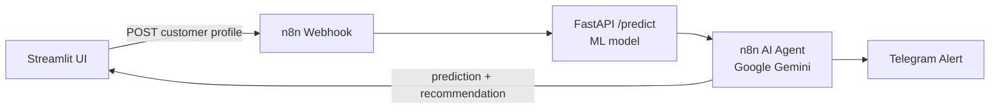

# Telco Churn Prediction & Agentic Retention Workflow

An end-to-end **agentic machine learning system** that predicts customer churn and acts on it autonomously. A trained churn classifier is served over a REST API, orchestrated by an LLM-powered agent workflow in n8n that reasons over each prediction, recommends a concrete retention action, and pushes real-time alerts to a retention team via Telegram — all driven from an interactive Streamlit demo UI.

## Architecture



1. The Streamlit app submits a raw customer profile to an n8n webhook.
2. n8n calls the FastAPI endpoint, which runs the full scikit-learn pipeline (preprocessing + classifier) and returns the churn prediction and probability.
3. An AI agent (Google Gemini) reasons over the prediction and the customer's attributes, then produces one specific retention action.
4. The workflow sends a Telegram alert to the retention team and returns the full result to the Streamlit UI.

## Tech Stack

- **Python** — pandas, scikit-learn, Jupyter
- **FastAPI** — REST model serving
- **Streamlit** — interactive demo UI
- **n8n** (self-hosted via Docker) — agentic workflow orchestration
- **Google Gemini API** — LLM reasoning for retention recommendations
- **Telegram Bot API** — automated alerting

## Features

- Data cleaning & exploratory data analysis on the IBM Telco Customer Churn dataset
- Trained Logistic Regression churn classifier with full evaluation (ROC-AUC, recall-focused model selection)
- K-Means customer segmentation with churn-rate profiling per segment
- REST API model serving with the complete preprocessing + inference pipeline bundled
- Agentic workflow with autonomous LLM reasoning over every prediction
- Automated Telegram retention alerts
- Interactive Streamlit demo: live predictions and polished data-insight visualizations

## Project Structure

```
├── data/               # Raw and cleaned Telco churn datasets
├── notebooks/          # Jupyter notebook: data prep, EDA, model development
├── api/                # FastAPI app serving the trained pipeline
├── app/                # Streamlit demo UI
├── n8n/                # Importable n8n agentic workflow (JSON)
├── models/             # Serialized sklearn pipeline + sample API input
└── requirements.txt    # Project dependencies
```

## Getting Started

### 1. Clone & set up the environment

```bash
git clone <repo-url>
cd "Telco Customer Churn Prediction + Agentic Retention Workflow"
python -m venv venv
venv\Scripts\activate        # Windows (source venv/bin/activate on macOS/Linux)
pip install -r requirements.txt
```

### 2. Run the FastAPI model server

```bash
uvicorn api.main:app --reload --port 8000
```

### 3. Run n8n (Docker)

```bash
docker run -it --rm -p 5678:5678 -v n8n_data:/home/node/.n8n docker.n8n.io/n8nio/n8n
```

Then in the n8n UI: **Import from File** → `n8n/churn_retention_workflow.json`, attach your own **Google Gemini API key** and **Telegram bot credentials** (plus chat ID), and activate the workflow.

### 4. Run the Streamlit demo

```bash
streamlit run app/streamlit_app.py
```

## Model Performance

Final model: **Logistic Regression** (`class_weight='balanced'`), selected over Random Forest on ROC-AUC and recall — the metrics that matter under class imbalance, where missing a true churner is the costly error.

| Metric | Score |
|---|---|
| Accuracy | 0.738 |
| Precision | 0.504 |
| Recall | 0.783 |
| F1 Score | 0.614 |
| ROC-AUC | 0.842 |
